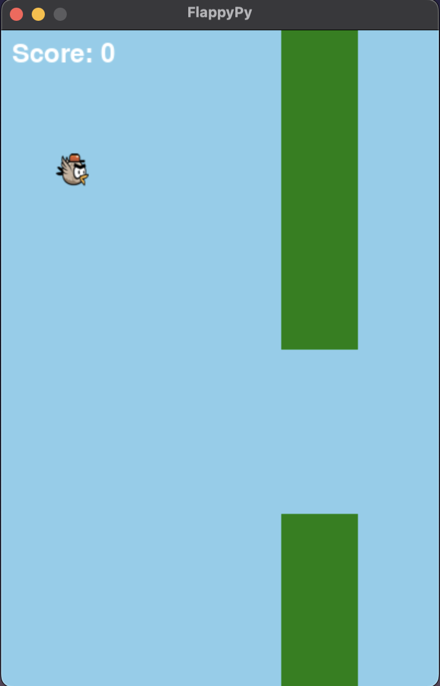
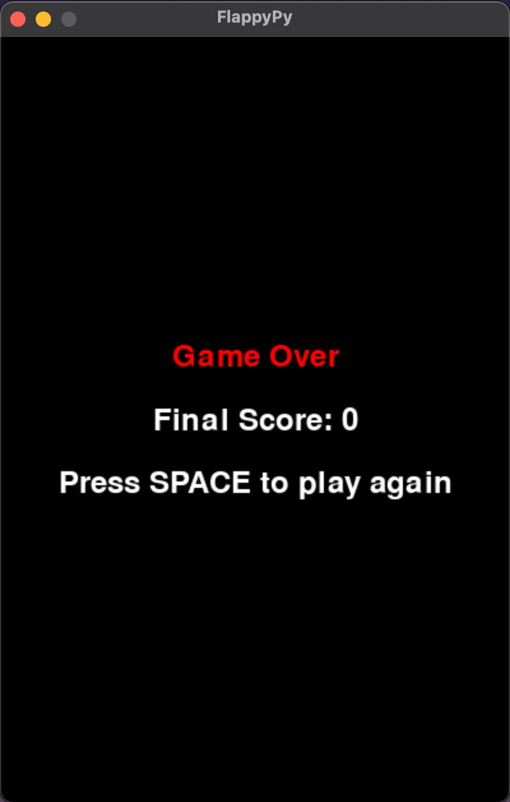
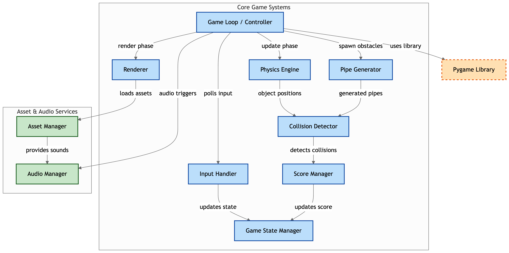

# **FlappyPy**
A Python implementation of the classic Flappy Bird game built with pygame.

Author: [Nima Boubanian](mailto:nima.boubanian@studio.unibo.it)

## Abstract

FlappyPy represents a **educational software engineering project** that transforms the classic Flappy Bird gaming experience into a professional Python 3.9+ implementation showcasing industry-standard development practices. The project demonstrates complete software development lifecycle execution from initial concept through GitHub release deployment, featuring physics-based gameplay mechanics, collision detection systems, and automated testing architecture spanning 55+ tests across 9 modules.

  

The technical implementation embraces **object-oriented programming principles** with clean architecture separating concerns across Bird physics, Pipe generation, collision detection, and scoring systems. The scoring component uniquely demonstrates Test-Driven Development methodology for educational value, while the broader system employs conventional development practices with comprehensive post-implementation testing validation.

  

**Professional deployment practices** include automated GitHub Actions CI/CD pipelines that validate code quality across Windows, macOS, and Linux platforms with Python 3.9-3.11 compatibility before creating GitHub releases with Apache 2.0 licensing. The educational-focused distribution strategy prioritizes accessibility and learning value while demonstrating industry-standard version control, semantic versioning, and quality assurance methodologies essential for software engineering education.

## Project Highlights

**Technical Achievements:**
- Python 3.9+ implementation with cross-platform compatibility
- 55+ comprehensive tests across 9 specialized modules
- GitHub Actions CI/CD with automated releases
- Apache 2.0 licensing for educational accessibility

**Educational Value:** FlappyPy serves as a complete software engineering learning resource, demonstrating professional development workflows from requirements analysis through deployment while maintaining engaging gameplay that showcases physics simulation, collision detection algorithms, and real-time graphics rendering capabilities.

## Disclaimer

During the development of this project, the author(s) utilized the **Claude Sonnet 4.0** LLM model to assist with error analysis, best practice recommendations, and code annotation enhancements. Additionally, the **Gemini 2.5 Pro** LLM model was employed to help summarize sections of the final report. All UML diagrams were generated using **PlantUML**, with the corresponding `.pu` source files available in `/sections/03-design/` path in the [project's report repository](https://github.com/unibo-dtm-se-2425-FlappyPy/report).

After using this assistance, the author(s) implemented all code independently, reviewed and tested all functionality thoroughly, and take(s) full responsibility for the content of the final artifact and comprehensive project documentation.
