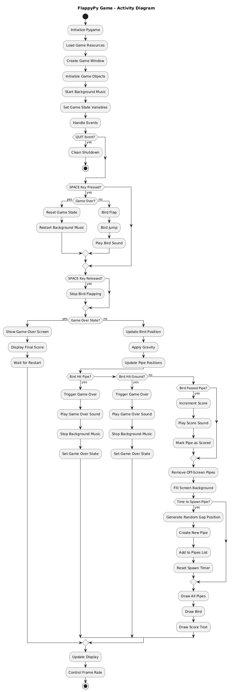
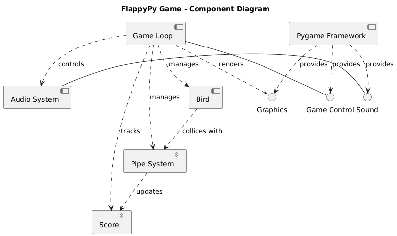
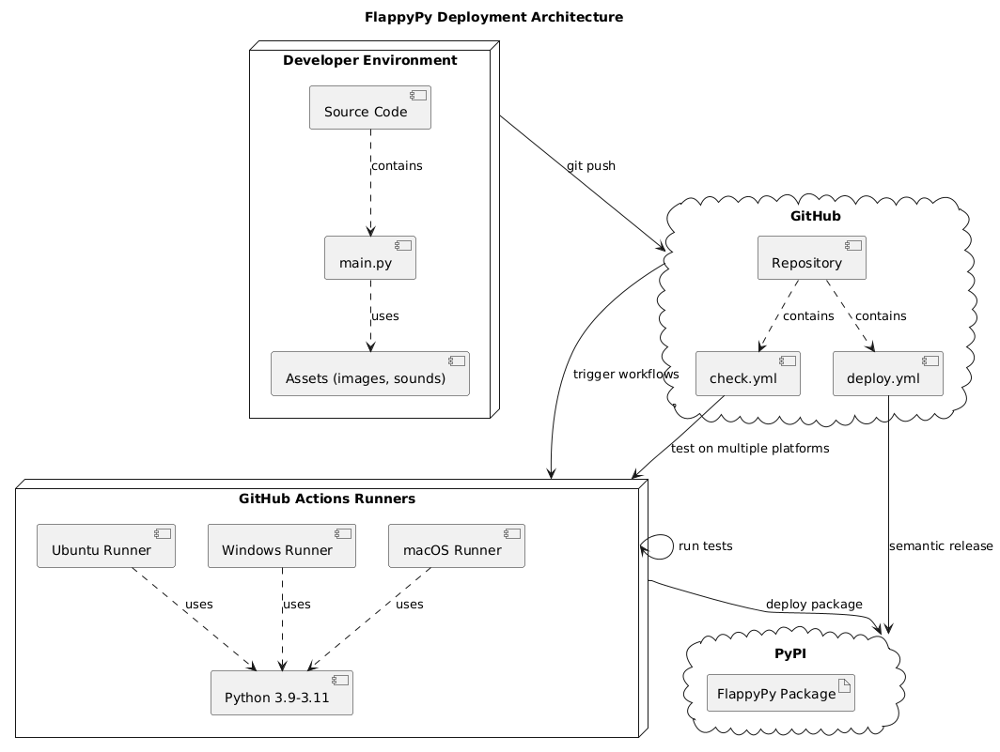
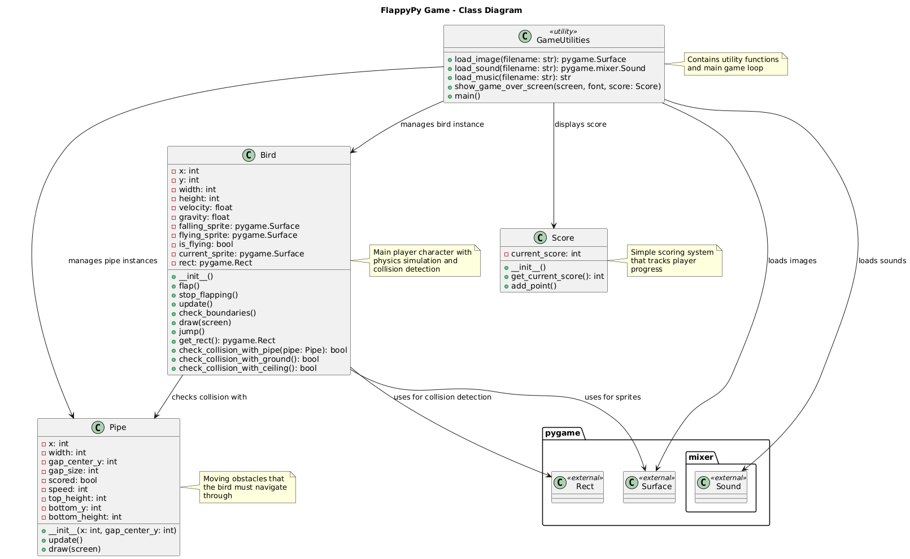
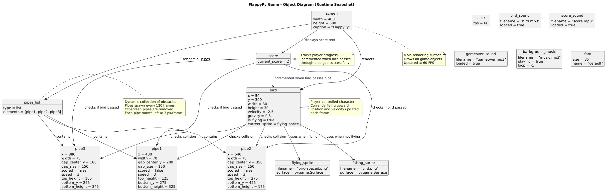
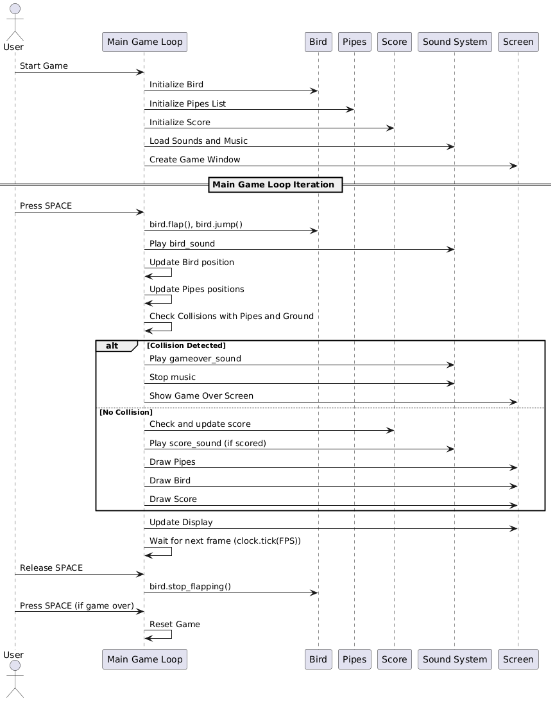
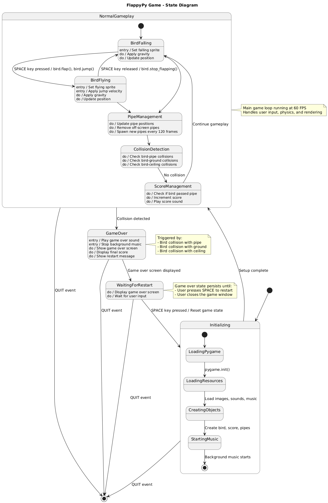

# Design

## Architecture

### Architectural Style

**Event-Based Architecture with Object-Oriented Design**

- **Event-driven model** with audio feedback and visual state management
- **Resource management system** for sprites, sounds, and music
- **State-based gameplay** with restart functionality

### High-Level Architecture Overview

**Activity UML Diagram**

**Initialization Flow**

The game begins with the standard pygame initialization sequence, loading all necessary resources (images, sounds, music) and setting up the game window and initial game objects.

**Main Game Loop Structure**

The main game loop that runs continuously at 60 FPS, processing events, updating game state, and rendering the screen.

**Decision Points**

The Activity diagram includes several key decision points:
- Event Processing: Handling different types of user input and system events
- Game State Checks: Distinguishing between normal gameplay and game over states
- Collision Detection: Multiple collision checks for pipes, ground, and boundaries
- Scoring Logic: Determining when the player successfully passes through pipes
- Resource Management: Deciding when to spawn new pipes and remove old ones

**Game Over Handling**

The diagram shows how collision detection triggers the game over sequence, including sound effects, music stopping, and displaying the final score with restart options.

**Pipe Management**

The activity flow includes the dynamic pipe spawning system that generates new obstacles at regular intervals with randomized gap positions, ensuring continuous gameplay challenge.

### Component Responsibilities

**Component UML Diagram**

**Main Game Engine**

The central component that orchestrates all game systems and manages the main game loop. It coordinates between different subsystems and maintains the overall game state.

**Game Object Components**

- Bird Component: Encapsulates the player character with physics simulation, sprite management, and collision detection.
- Pipe Component: Manages obstacle generation, movement, and positioning with randomized gap placement.
- Score Component: Handles score tracking and display logic

**System Components**

- Audio System: Manages background music and sound effects with proper resource loading
- Graphics System: Handles all rendering operations including sprites, text, and screen updates
- Input Handler: Processes keyboard events, specifically SPACE key for bird control
- Resource Loader: Manages loading of images, sounds, and music files with fallback handling
- Collision Detection: Implements physics simulation and collision checking algorithms

**External Dependencies**

- Pygame Framework: Provides the core game development functionality
- System Resources: Represents the underlying operating system resources

**Key Interfaces**

- Game Loop: Main coordination interface for game execution
- Physics: Interface for physics simulation and collision detection
- Rendering: Interface for all graphics and display operations
- Audio API: Interface for sound and music playback
- Input Events: Interface for user input processing
- Asset Loading: Interface for resource management

## Infrastructure

### Resource Management

- Cross-platform Compatibility: Support for Python 3.9+ with importlib.resources.
- Fallback Mechanisms: Mock sprites and silent audio for testing.
- Package Structure: Assets organized in separate directories.

### Deployment

The FlappyPy project follows a modern CI/CD deployment pipeline:

- Development Environment: Where the Python game code is developed.
- GitHub Repository: Source control and workflow orchestration.
- GitHub Actions Runners: Multi-platform testing and deployment execution.
- PyPI: Final deployment target for the Python package.

**Deployment UML Diagram**

## Modelling

### Class Design

The FlappyPy game consists of three main classes that work together to create the game functionality:
- Bird: The player-controlled character with physics and collision detection.
- Pipe: The obstacles that move across the screen.
- Score: Tracks and manages the player's score.

**Class UML Diagram**

**Bird** Class
- Contains all physics-related attributes (position, velocity, gravity).
- Manages sprite states (flying vs falling).
- Handles collision detection with pipes, ground, and ceiling.
- Implements game physics through the update() method.

**Pipe** Class
- Represents the moving obstacles in the game.
- Manages pipe positioning and gap calculations.
- Contains drawing logic for both top and bottom pipe segments.
- Tracks whether the bird has scored by passing through.

**Score** Class
- Simple class for tracking the player's current score.
- Provides methods to increment score and retrieve current value.
- Used by the main game loop to display and manage scoring.

**GameUtilities** Class
- Represents the utility functions and main game loop.
- Handles resource loading (images, sounds, music).
- Manages the game over screen display.
- Contains the main game loop that coordinates all components.

### Object Relationships Design

- Bird-Pipe Interactions: The bird object checks collision with each pipe instance.
- Collection Management: The pipes_list contains and manages multiple pipe instances.
- Scoring System: Score object monitors bird's progress relative to pipe positions.
- Rendering Pipeline: Screen object renders all game objects in the proper order.

**Object UML Diagram**

## Interaction

**Sequence UML Diagram**

**Initialization Phase**

The game begins with the game initialization where the main loop sets up all necessary components:
- Creates the Bird instance.
- Initializes an empty pipes list.
- Sets up the scoring system.
- Loads sound effects and background music.
- Creates the game window.

**Main Game Loop**

The core gameplay is represented in the "Main Game Loop Iteration" section, which shows:
- User Input: Player presses SPACE to make the bird flap.
- Bird Response: The bird executes flap() and jump() methods.
- Audio Feedback: Sound system plays the bird sound.
- Physics Updates: Bird and pipes positions are updated.
- Collision Detection: The system checks for collisions.

**Conditional Flow**

The game uses an alt/else structure to show two possible outcomes:
- Collision Path: Game over sequence with sound effects and game over screen.
- Normal Path: Score checking, rendering all game elements, and continuing gameplay.

**Game State Management**
- Frame rate control through clock.tick(FPS).
- Bird state changes when SPACE is released.
- Game reset functionality when restarting after game over.

## Behaviour

The FlappyPy game operates through several distinct states:

- Initialization State: Setting up pygame, loading resources, and creating game objects.
- Normal Gameplay: The main game loop with active bird control and collision detection.
- Game Over State: When collision is detected and the game stops.
- Bird States: Flying and falling states within normal gameplay.

The state transitions are triggered by various events:

- User Input: Space key press/release for bird control and game restart.
- Collision Detection: Bird hitting pipes or ground boundaries.
- System Events: Pygame quit events
Timer Events: Pipe spawning and frame rate control.

**State UML Diagram**

## Data-Related Aspects

- **Audio Resources**: Sound objects loaded once at startup
- **Sprite Cache**: Bird sprites loaded and stored in Bird object
- **Frame Counters**: `frames_since_spawn` for pipe generation timing
- **Score Persistence**: Score maintained until game restart
- **Asset Reuse**: Sprites and sounds loaded once, reused throughout game
- **Efficient Cleanup**: List comprehension for pipe removal
- **State Reset**: Complete object recreation on restart